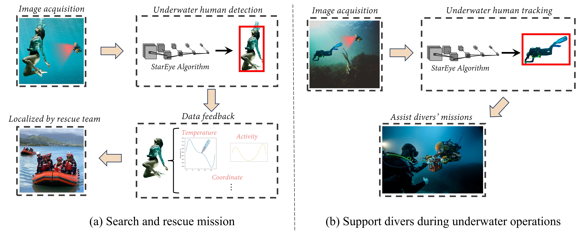

# StarEye
Official code repository for "StarEye: An advanced model for underwater human detection"

  

### 🚀 **Detailed tutorial is coming soon!**  
*Stay tuned for an in-depth guide with step-by-step instructions and examples!*  

---

#### 📚 **Model Structure**  
The overall architecture of the model is documented here:  
`./models/StarEye.yaml`  

#### 🔍 **Block Code Reference**  
The implementation details can be found in this directory:  
`./ultralytics/nn/extra_modules`  
